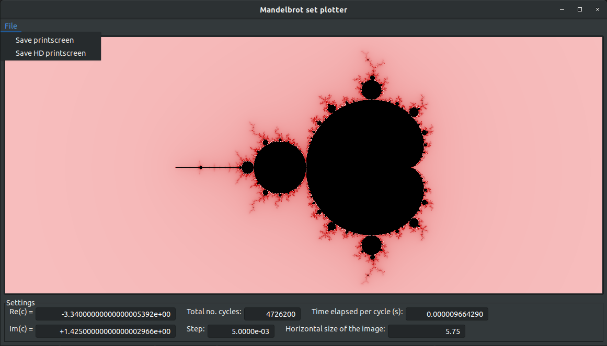

# Mandelbrot set plotter

[](https://www.gnu.org/licenses/gpl-3.0)

[](.github/workflows/linux-x86_64.yml)
[](.github/workflows/win-mingw64-x86_64.yml)
[](https://www.codacy.com/gh/dmfrodrigues/mandelbrot/dashboard?utm_source=github.com&amp;utm_medium=referral&amp;utm_content=dmfrodrigues/mandelbrot&amp;utm_campaign=Badge_Grade)

A Mandelbrot set plotter based on module [fractal-app](https://github.com/dmfrodrigues/fractal-app/).

Only supports 64bit architectures; although 32bit wxWidgets binaries are available, the wxWidgets team only makes available through package managers the 64bit version, so to reduce complexity we will only be supporting 64bit architectures.

## Media




## Install

Microsoft Windows (MSW) binaries already come bundled with the required library files so you just need to unzip and execute.

Under Linux, you need to have the required wxWidgets libraries installed in your computer, whether you're building from source or using the binaries:
```sh
sudo apt install libwxgtk3.0-gtk3-dev   # Ubuntu 18.10, 20.04
```

Under MSW, you only need the wxWidgets libraries if you are building from source; we strongly advise using [MinGW-w64](https://mingw-w64.org/doku.php) and the corresponding [wxWidgets precompiled binaries](https://www.wxwidgets.org/downloads/) of the latest stable release. You can get the MinGW-w64 from the following places:
- MinGW-w64: from [my dropbox](https://www.dropbox.com/s/2vlr813fjmyhp1r/x86_64-8.1.0-release-posix-seh-rt_v6-rev0.7z?dl=1) (if you trust me enough)
- MinGW-w64: do it the right way and get it from the official page; on installing use version 8.1, `posix` threads and `seh` exceptions, this is VERY IMPORTANT as it is the only MSW setup we have tested to be working.
- wxWidgets: from wxWidgets, you have to install and unzip [the header files](https://github.com/wxWidgets/wxWidgets/releases/download/v3.0.5/wxWidgets-3.0.5-headers.7z), [the development files](https://github.com/wxWidgets/wxWidgets/releases/download/v3.0.5/wxMSW-3.0.5_gcc810_x64_Dev.7z) and [the release DLLs](https://github.com/wxWidgets/wxWidgets/releases/download/v3.0.5/wxMSW-3.0.5_gcc810_x64_ReleaseDLL.7z).
- wxWidgets: you can also get the zipped files by visiting [wxWidgets](https://www.wxwidgets.org/downloads/), selecting Windows binaries, selecting MinGW-w64 8.1, and dowload the header files and the 64bit development files and DLLs.

### Binaries

Binaries are available for download, please check the releases.

### Compiling from source code

This project (as well as fractal-app) uses CMake to easily allow compiling in different OSs.

In both Linux bash and MS Windows cmd, the following commands will compile the program:

```sh
mkdir build
cd build
cmake ..
cmake --build . # add '--config Release' to get the release version, without console
```

The executable binary file is in the root folder, with file name `mandelbrot` (or `mandelbrot.exe` under MSW)

## Math

### Complex numbers

The mathematics of this aesthetic structure are quite simple actually, which makes it even more impressing how so simple relations can give rise to beautiful, chaotic patterns.

A complex number is a point in the special 2D plane called the complex plane. A complex number can be thus represented as a pair of numbers (Re,Im) or in the equivalent algebraic notation R+*i*\*Im. Operations in this plane are made in a specific way:
- *i* is the imaginary unit, which is equal to √(-1), such that *i*²=-1.
- Adding two complex numbers is done by adding each component: (Re1+*i*\*Im1)+(Re2+*i*\*Im2) = (Re1+Re2)+*i*\*(Im1+Im2).
- Multiplying two complex numbers is done by considering *i*²=-1: (Re1+*i*\*Im1)\*(Re2+*i*\*Im2) = (Re1\*Re2-Im1\*Im2) + *i*\*(Re1\*Im2+Re2\*Im1).

A complex number can otherwise be represented in polar notation (r, θ) where Re+*i*\*Im = r\*e^(*i*\*θ), with the conversion formulas:
- r = √(Re²+Im²)
- θ = atan2(Im, Re)
- Re = r\*cos(θ)
- Im = r\*sin(θ)
This notation takes it easier to interpret powers of complex numbers: (r\*e^(*i*\*θ))^x = (r^x)\*e^(*i*\*x\*θ).

### Mandelbrot set

The Mandelbrot set was discovered by Pierre Fatou and Gaston Julia, but it was named after Benoit Mandelbrot who was the first to computationally visualize the set and its fractal properties.

Consider the iterative function which depends on complex number c:
- z(0) = 0
- z(i+1)=z(i)²+c

The Mandelbrot set is the set M of complex numbers c such that c∈M iff, for that value of c, z(∞) does not diverge.

It can be easily proven that, if |z(i)|>2, |z(i+1)|>|z(i)| (i.e., if at any point |z(i)|>2 the series diverges). This basically means the previous condition is that c∈M iff |z(∞)|≤2. It also provides an interesting result in terms of the computational approach, as a computer does not really know what 'diverge' stands for, but it knows how to check if |z(i)|>2.

The results of this process can then be plotted in the complex plane; the mathematical approach usually has the pixels corresponding to points in M drawn in black, and points not in M drawn in white. However, the experience can be made more interesting we consider other criteria to draw these points. Points in M cannot be easily distinguised as they will always remain in M (one could color them according to the number of iterations in a cycle, but that is a bit hard); however, computers cannot calculate infinite series in finite time, so it would be interesting to color points differently according to how many iterations it took to realize they were not in M. As such, one can consider all the points in the complex plane start by being in M since z(0)=0. As the computer performs more iterations until iteration i, it will realize that, for some points that were initially in M, |z(i)|>2; this means the points were before in M because there was not enough computational power to realize it was not in M, but now that there have been performed enough iterations c is indeed not in M; thus, for each point that diverges we can save the iteration at which it diverged and the value of z just before diverging, and then find a way to colour that point.
